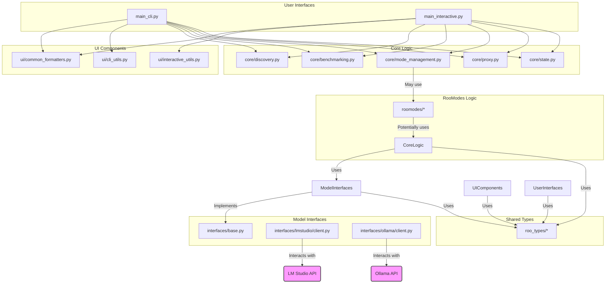

# rooBroker Refactoring Plan

This document outlines the plan for restructuring and modernizing the `rooBroker` Python codebase to achieve a modular, testable, and domain-separated design.

**Date:** 2025-04-25

## 1. Analysis Summary

*   The current `src/rooBroker/main.py` mixes CLI parsing (`argparse`), interactive UI (`rich`), core logic execution (discovery, benchmarking, proxy, mode updates), and utility functions (pretty printing, state saving).
*   Existing modules (`lmstudio`, `roomodes`, `roo_types`) provide a good starting point for domain separation.
*   The `ollama` domain needs to be added, initially supporting discovery and basic interaction.
*   Testing infrastructure using `pytest` needs to be established.
*   Both CLI and interactive menu interfaces are considered equally important.
*   The goal is a modular, testable structure where core logic is independent of the presentation layer (CLI/UI).

## 2. Proposed New Directory Structure

```
rooBroker/
├── .gitignore
├── pyproject.toml
├── README.md
├── requirements.txt
├── memory-bank/
│   ├── ... (existing files)
├── src/
│   └── rooBroker/
│       ├── __init__.py
│       ├── main_cli.py         # New: Entry point for CLI (argparse)
│       ├── main_interactive.py # New: Entry point for interactive menu (rich)
│       ├── core/               # New: Houses abstracted core logic
│       │   ├── __init__.py
│       │   ├── discovery.py    # Logic for discovering models (LM Studio, Ollama)
│       │   ├── benchmarking.py # Logic for benchmarking (LM Studio initially)
│       │   ├── mode_management.py # Logic for updating .roomodes
│       │   ├── proxy.py        # Logic for the context optimization proxy
│       │   └── state.py        # Logic for saving/loading state (e.g., .modelstate.json)
│       ├── interfaces/         # New: Handles different model provider interactions
│       │   ├── __init__.py
│       │   ├── base.py         # Base class/interface for model providers
│       │   ├── lmstudio/       # Domain-specific client/interaction logic
│       │   │   ├── __init__.py
│       │   │   ├── client.py     # Refactored LM Studio client interactions
│       │   │   └── utils.py      # LM Studio specific helpers (if any)
│       │   └── ollama/         # New: Domain-specific client/interaction logic
│       │       ├── __init__.py
│       │       ├── client.py     # Ollama client interactions (discovery, basic ops)
│       │       └── utils.py      # Ollama specific helpers (if any)
│       ├── roo_types/          # Existing: Shared data types/models
│       │   ├── __init__.py
│       │   ├── benchmarking.py
│       │   ├── discovery.py
│       │   ├── models.py
│       │   ├── modes.py
│       │   ├── py.typed
│       │   └── settings.py
│       ├── roomodes/           # Existing: RooMode generation/update logic (might move parts to core)
│       │   ├── __init__.py
│       │   ├── analysis_parsing.py
│       │   ├── mode_generation.py
│       │   ├── update.py       # Core logic likely moves to core/mode_management.py
│       │   └── utils.py
│       └── ui/                 # New: UI components (rich tables, prompts)
│           ├── __init__.py
│           ├── cli_utils.py    # Utilities specific to the CLI output
│           ├── interactive_utils.py # Utilities specific to the rich menu
│           └── common_formatters.py # Shared formatting logic (e.g., pretty_print tables)
├── tests/                  # New: Pytest tests
│   ├── __init__.py
│   ├── core/
│   │   └── test_discovery.py
│   │   └── ...
│   ├── interfaces/
│   │   ├── lmstudio/
│   │   │   └── test_client.py
│   │   │   └── ...
│   │   └── ollama/
│   │       └── test_client.py
│   │       └── ...
│   └── roomodes/
│       └── test_update.py
│       └── ...
└── .modelstate.json        # Existing state file (consider moving to a config/data dir)
```

## 3. Refactoring Plan & Key Changes

*   **Split `main.py`:**
    *   Create `main_cli.py`: Handles `argparse` setup and calls core logic functions based on commands. Uses `ui/cli_utils.py` and `ui/common_formatters.py` for output.
    *   Create `main_interactive.py`: Handles `rich` menu setup, prompts, and calls core logic functions. Uses `ui/interactive_utils.py` and `ui/common_formatters.py` for display.
*   **Abstract Core Logic (`src/rooBroker/core/`):**
    *   Move discovery logic from `lmstudio/discovery.py` and `main.py` into `core/discovery.py`. Design it to handle multiple providers (LM Studio, Ollama) via the `interfaces` layer.
    *   Move benchmarking logic from `lmstudio/benchmark.py`, `lmstudio/deepeval.py`, and `main.py` into `core/benchmarking.py`. It will use the `interfaces` layer.
    *   Move `.roomodes` update logic from `roomodes/update.py` and `main.py` into `core/mode_management.py`.
    *   Move proxy logic from `lmstudio/context_proxy.py` and `main.py` into `core/proxy.py`.
    *   Move state saving (`save_modelstate`) from `main.py` into `core/state.py`.
*   **Create Interface Layer (`src/rooBroker/interfaces/`):**
    *   Define a base class/protocol in `interfaces/base.py` outlining common methods (e.g., `discover_models`, `get_model_info`, potentially `run_benchmark_task`).
    *   Refactor `lmstudio/client.py` (and potentially other `lmstudio` files) into `interfaces/lmstudio/client.py`, implementing the base interface.
    *   Create `interfaces/ollama/client.py` implementing the base interface for discovery and basic interaction.
*   **Isolate UI Components (`src/rooBroker/ui/`):**
    *   Extract `rich`-based table formatting (`pretty_print_*`) and prompts (`select_models*`) from `main.py` into `ui/common_formatters.py` and `ui/interactive_utils.py`.
    *   Create `ui/cli_utils.py` if specific CLI formatting is needed beyond the common formatters.
*   **Refine `roomodes`:** Analyze `roomodes` modules (`analysis_parsing.py`, `mode_generation.py`, `utils.py`) to see if parts belong in `core` or can remain domain-specific. The `update.py` logic moves to `core`.
*   **Refine `roo_types`:** Ensure types are comprehensive and used consistently across all new modules. Add types for Ollama models/responses.
*   **Testing (`tests/`):** Create `pytest` tests for core logic components and interface clients. Use mocking (`unittest.mock`) extensively to test logic without needing live LM Studio/Ollama instances.

## 4. High-Level Migration Steps

1.  **Setup:** Create the new directory structure (`core`, `interfaces`, `ui`, `tests`, `ollama`). Add `__init__.py` files.
2.  **Types:** Update `roo_types` with any new required types (e.g., for Ollama).
3.  **UI Extraction:** Move UI components (`pretty_print_*`, `select_models*`, etc.) from `main.py` to the `ui/` directory.
4.  **Interface Layer:** Define `interfaces/base.py`. Refactor `lmstudio` code into `interfaces/lmstudio/client.py`. Create initial `interfaces/ollama/client.py`.
5.  **Core Logic Abstraction:** Gradually move logic from `main.py` and existing domain modules into the respective `core/` modules, making them use the new `interfaces` layer.
6.  **Split Entry Points:** Create `main_cli.py` and `main_interactive.py`, connecting them to the `core` logic and `ui` components. Remove the old `main.py` or keep it as a simple dispatcher.
7.  **Testing:** Write `pytest` tests for the refactored `core` and `interfaces` modules.
8.  **Refine & Iterate:** Clean up imports, ensure type hinting is consistent, and test thoroughly.

## 5. Visualization (Component Interaction)



## 6. Sample LLM Prompts for Refactoring Assistance

*   **Extracting UI Logic:**
    > "Analyze the Python code in `src/rooBroker/main.py`. Identify all functions related to formatting output using the `rich` library (e.g., `pretty_print_models`, `pretty_print_benchmarks`) and functions handling user input prompts (`select_models_by_number`). Refactor these functions into a new module `src/rooBroker/ui/common_formatters.py` and `src/rooBroker/ui/interactive_utils.py` respectively. Ensure the new functions accept necessary data as arguments and return formatted strings or collected user input. Use Python 3.11+ type hints."

*   **Creating Core Discovery Logic:**
    > "Create a Python module `src/rooBroker/core/discovery.py`. Define a function `discover_all_models()` that utilizes provider clients from `src/rooBroker/interfaces/`. It should instantiate clients for LM Studio (`interfaces.lmstudio.client.LMStudioClient`) and Ollama (`interfaces.ollama.client.OllamaClient`), call their respective `discover_models()` methods (assuming these methods exist and adhere to a common interface defined in `interfaces/base.py`), aggregate the results, and return a list of discovered models conforming to `roo_types.discovery.DiscoveredModel`. Handle potential errors from each provider gracefully. Use Python 3.11+ type hints."

*   **Refactoring LM Studio Client:**
    > "Refactor the existing LM Studio interaction logic found in `src/rooBroker/lmstudio/client.py`, `discovery.py`, `benchmark.py`, etc. Consolidate the core API interaction logic into a class `LMStudioClient` within `src/rooBroker/interfaces/lmstudio/client.py`. This class should implement the interface defined in `src/rooBroker/interfaces/base.py`. Ensure methods like `discover_models`, `get_model_details`, `run_completion` (or similar for benchmarking tasks) are implemented. Use Python 3.11+ type hints and focus on API interaction, removing any UI or complex orchestration logic."